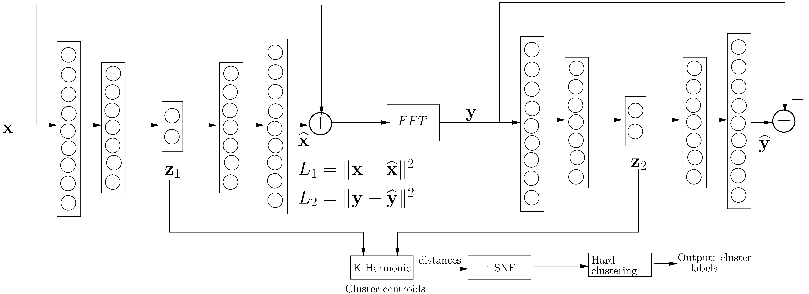
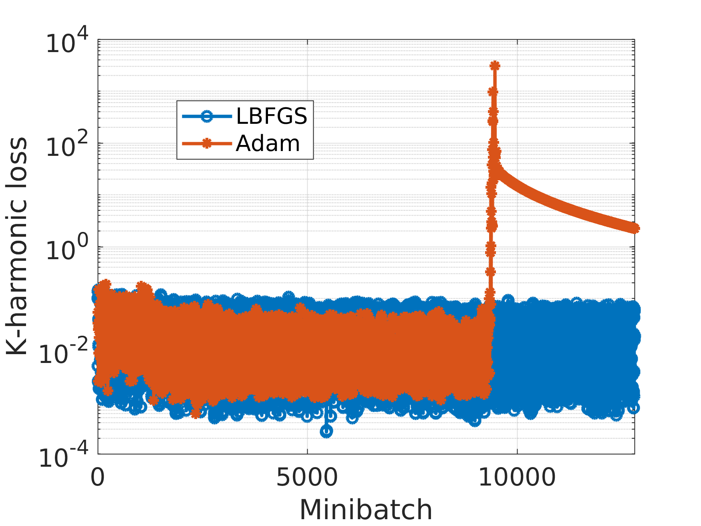
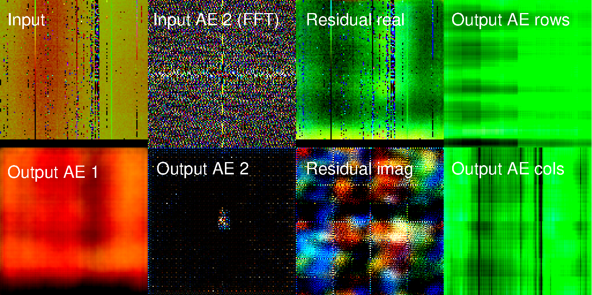
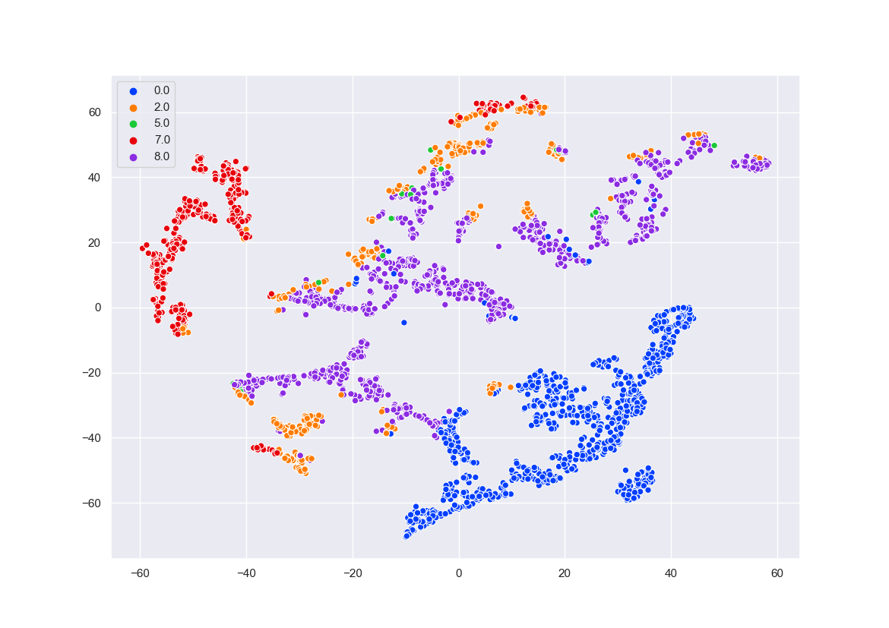
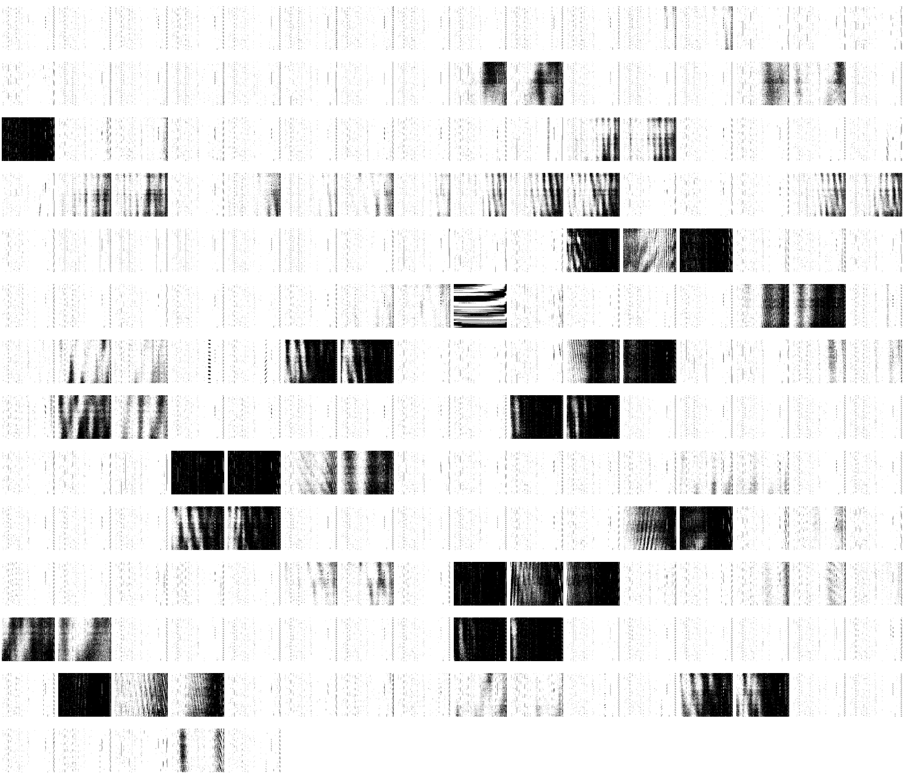

# LSHM : LOFAR System Health Management
We use a cascaded autoencoder duo with k-harmonic clustering to learn features in LOFAR spectrograms. The autoencoders work in the real space and the Fourier space of the spectrograms. We combine [Deep K-means](https://arxiv.org/abs/1806.10069) and [K Harmonic means](https://www.hpl.hp.com/techreports/2000/HPL-2000-137.html) to implement deep-K-Harmonic means clustering.

Files included are:

``` lofar_models.py ``` : Methods to read LOFAR H5 data and Autoencoder models.

``` kharmonic_lofar.py ``` : Train K-harmonic autoencoders (in real and Fourier space) as well as perform clustering in latent space.

``` evaluate_clustering.py ``` : Load trained models and print clustering results for given dataset.

``` lbfgsnew.py ``` : Improved LBFGS optimizer.





The above image shows the two autoencoders that extract latent space representations for the real and Fourier space spectrograms.





Sometimes Adam will diverge (see figure above), and LBFGS will give a more stable result.




The above figure shows of an example of the autoencoders in action: top left: input **x**, bottom left: output **xhat** of the first autoencoder,
top right: input **y**, bottom right: output **yhat** of the second autoencoder.


Below is one example, the first figure shows the t-SNE plot, and following that, the spectrograms for two closest cluster ids.





