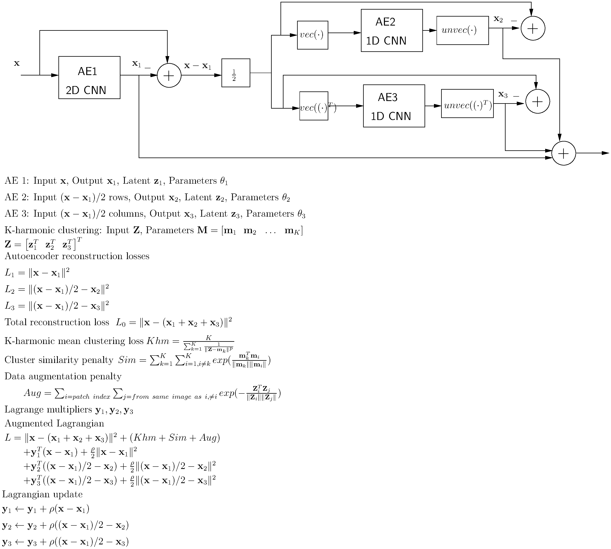

# LSHM : LOFAR System Health Management
We use a cascaded autoencoder duo with k-harmonic clustering to learn features in LOFAR spectrograms. The autoencoders work in the real space and the Fourier space of the spectrograms. We combine [Deep K-means](https://arxiv.org/abs/1806.10069) and [K Harmonic means](https://www.hpl.hp.com/techreports/2000/HPL-2000-137.html) to implement deep-K-Harmonic means clustering.

Files included are:

``` lofar_models.py ``` : Methods to read LOFAR H5 data and Autoencoder models.

``` kharmonic_lofar.py ``` : Train K-harmonic autoencoders (in real and Fourier space) as well as perform clustering in latent space.

``` evaluate_clustering.py ``` : Load trained models and print clustering results for given dataset.

``` lbfgsnew.py ``` : Improved LBFGS optimizer.

``` train_graph.py ``` : Build a line-graph using baselines and train a classifier (Pytorch Geometric).




The above image shows the two autoencoders that extract latent space representations for the real and Fourier space spectrograms.


## How to train
Sometimes Adam will diverge (see figure above), and LBFGS will give a more stable result. Here is a training strategy that will generally work:

 - Set alpha=beta=gamma=0.001 (a low value), use Adam for training the autoencoders, a few epochs.
 - Increase alpha, beta, gamma (say to 0.01 and thereafter 0.1) and use LBFGS for the remainder of the training.
 - Always keep an eye for the k-harmonic loss exploding (as shown in the figure above). Control this by tuning alpha.
 - Important: divide the training into three: i) 2D CNN, ii) 1D CNN and iii) K Harmonic model, and iteratively update parameters of each of these models. This will give a stable result.


The above figure shows of an example of the autoencoders in action: top left: input **x**, bottom left: output **xhat** of the first autoencoder,
top right: input **y**, bottom right: output **yhat** of the second autoencoder.


Below is one example, the first figure shows the t-SNE plot, and following that, the spectrograms for two closest cluster ids.


